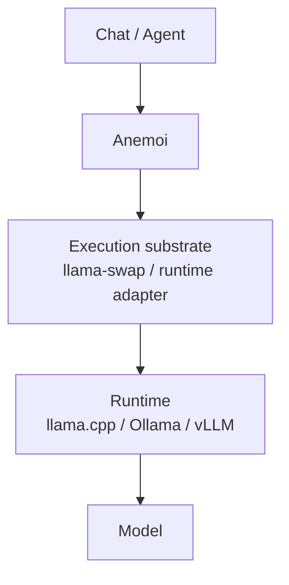
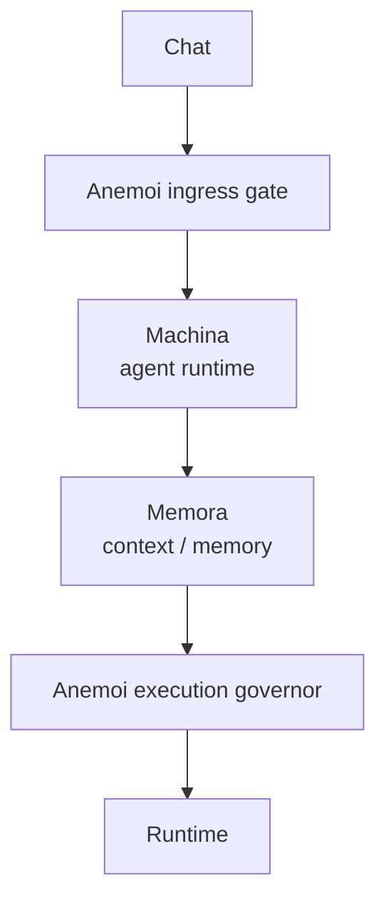
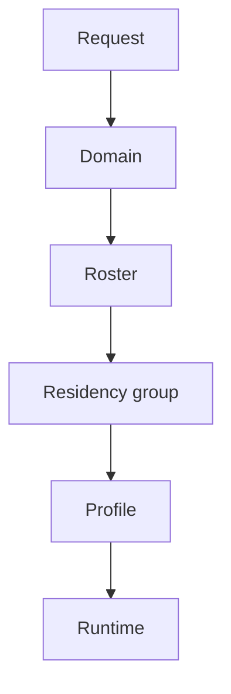
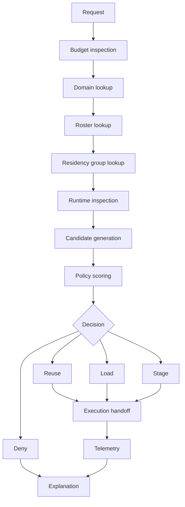

# Anemoi

## Purpose

Anemoi is a proposed local-first inference governance layer for heterogeneous AI systems on [[systems/prometheus]].

It does not perform inference and does not replace runtimes. Anemoi decides what should execute, where it should execute, whether execution should happen now, which resources should remain resident, which acceptable path is cheapest, and why that decision was made.

## Product Statement

Anemoi coordinates local inference resources across runtimes, models, and hardware tiers while preserving responsiveness, controlling cost, and making scheduling decisions observable.

## System Position



Anemoi may appear before execution as an ingress gate and during execution as a residency and continuity governor.

Optional future stack:



## Boundaries

### Anemoi owns

- Inference economics: reuse, promote, cold-load, downgrade, defer, stage, or deny.
- Residency governance: cold, loading, warm CPU, partial, hot GPU, serving, draining, evicting, and failed states.
- Residency groups: domain and roster aware scheduling targets.
- Continuity preservation: keeping small workers responsive while larger models load or remain deferred.
- Explainability: every scheduling decision must include a reason.

### Anemoi does not own

- Inference execution.
- Model weights.
- Agent planning.
- Memory.
- Retrieval.
- Training.
- Tool orchestration.
- Vector storage.
- Provider gateway behavior.

## Scheduling Model

Anemoi should schedule against residency groups, not raw model names.



Example residency group:

```yaml
small_swarm:
  models:
    - qwen3.5-9b
    - granite-4.1-8b
  purpose:
    - extraction
    - packet building
    - summarization
  keep_hot: true
  background_load: true
```

Example MoE-assisted group:

```yaml
moe_assisted:
  models:
    - qwen3.6-35b-a3b
    - qwen3.5-9b
  purpose:
    - interactive reasoning
    - coding assistance
    - continuity fallback
```

## First Proof Of Value

The first useful Anemoi behavior is not routing a prompt. The first useful behavior is avoiding a disruptive model load while preserving interaction continuity.

Target behavior:

```text
Anemoi avoided loading a large cold model,
reused a warm or hot acceptable model,
kept small workers alive,
staged the larger model only when policy allowed,
and explained the decision.
```

Example explanation:

```text
Selected qwen3.5-9b through llama-swap.

Reasons:
- qwen3.5-9b was already resident as part of the small_swarm group.
- qwen3.6-35b-a3b cold load cost exceeded the interactive latency budget.
- Continuity policy prefers degraded response over blank wait.
- Background loading is allowed for the moe_assisted group.
```

## Rust Implementation Plan

### Workspace layout

```text
anemoi/
  Cargo.toml
  crates/
    anemoi-core/
    anemoi-daemon/
    anemoi-runtime/
    anemoi-policy/
    anemoi-telemetry/
    anemoi-cli/
```

### Crate responsibilities

| Crate | Responsibility |
|---|---|
| `anemoi-core` | Shared domain types: requests, models, runtimes, residency states, decisions, explanations. |
| `anemoi-runtime` | Runtime adapters for [[systems/prometheus/opt/stacks/ai/core/ollama/ollama]], [[systems/prometheus/opt/stacks/ai/core/llamacpp/llamacpp]], and [[systems/prometheus/opt/stacks/ai/core/llama-swap/llama-swap]]. |
| `anemoi-policy` | Candidate generation, scoring, continuity policy, deny/defer/load/reuse decisions. |
| `anemoi-daemon` | Local control-plane API. |
| `anemoi-telemetry` | Decision logs, runtime snapshots, resident events, metrics, and traces. |
| `anemoi-cli` | Operator commands such as `status`, `residents`, `decide`, and `explain`. |

### Core types

```rust
pub enum ResidencyState {
    Cold,
    Loading,
    WarmCpu,
    Partial,
    HotGpu,
    Serving,
    Draining,
    Evicting,
    Failed,
}
```

```rust
pub enum DecisionAction {
    ReuseHot,
    PromoteWarm,
    ColdLoad,
    StageBackground,
    Downgrade,
    Defer,
    Deny,
}
```

```rust
pub struct Explanation {
    pub summary: String,
    pub reasons: Vec<DecisionReason>,
    pub rejected_options: Vec<RejectedOption>,
}
```

The explanation must be structured so it can be shown in a CLI, API response, log, or future UI.

### Runtime adapter trait

```rust
#[async_trait::async_trait]
pub trait RuntimeAdapter: Send + Sync {
    fn id(&self) -> RuntimeId;

    async fn inspect(&self) -> Result<RuntimeSnapshot, RuntimeError>;

    async fn load_model(&self, model: &ModelId) -> Result<LoadHandle, RuntimeError>;

    async fn unload_model(&self, model: &ModelId) -> Result<(), RuntimeError>;

    async fn execute(
        &self,
        request: ExecutionRequest,
    ) -> Result<ExecutionHandle, RuntimeError>;
}
```

Initial adapters should be implemented in this order:

1. `MockRuntimeAdapter`
2. `LlamaSwapAdapter`
3. `OllamaAdapter`
4. `LlamaCppAdapter`

The mock adapter should come first so policy behavior can be tested without touching live inference services.

### Scheduler pipeline



Initial scoring should remain deterministic and inspectable:

```text
score =
  quality_score
  - load_penalty
  - pressure_penalty
  - latency_penalty
  + continuity_bonus
  + residency_reuse_bonus
```

Every scoring contribution should create an explanation reason.

## API Surface

The daemon should expose a small local API, likely through `axum`.

| Endpoint | Purpose |
|---|---|
| `GET /health` | Basic daemon health. |
| `GET /status` | Runtime and policy summary. |
| `GET /residents` | Current normalized residency view. |
| `POST /decide` | Return a decision without executing. |
| `POST /execute` | Decide, hand off execution, and record telemetry. |
| `GET /decisions/:id` | Fetch a recorded decision. |
| `GET /explain/:id` | Fetch the explanation for a recorded decision. |

## CLI Surface

```text
anemoi status
anemoi residents
anemoi decide --domain coding --mode interactive
anemoi explain <decision-id>
anemoi runtimes
anemoi policy check
```

## Suggested Rust Stack

| Area | Crate |
|---|---|
| Async runtime | `tokio` |
| HTTP API | `axum` |
| HTTP client | `reqwest` |
| Serialization | `serde`, `serde_json`, `serde_yaml` |
| CLI | `clap` |
| Errors | `thiserror`, `anyhow` |
| Logging/tracing | `tracing`, `tracing-subscriber` |
| Storage | `sqlx` with SQLite |
| IDs | `uuid` |
| Time | `chrono` or `time` |
| Async traits | `async-trait` |

## Configuration Sketch

```yaml
domains:
  coding:
    rosters:
      - small_swarm
      - moe_assisted

residency_groups:
  small_swarm:
    keep_hot: true
    allow_background_load: true
    models:
      - qwen3.5-9b
      - granite-4.1-8b

models:
  qwen3.5-9b:
    family: qwen
    parameter_class: 9b
    runtime_class: cpu_agent
    supported_runtimes:
      - llama_swap

runtimes:
  llama_swap:
    adapter: llama_swap
    base_url: http://172.17.0.1:8085
```

## Testing Strategy

Policy tests should come before runtime integration tests.

Initial test coverage:

- Candidate generation.
- Resident model reuse.
- Cold-load avoidance.
- Continuity fallback.
- Runtime unavailable behavior.
- Memory pressure scoring.
- Explanation completeness.
- Decision log persistence.

Example test:

```rust
#[tokio::test]
async fn avoids_cold_large_model_when_small_worker_is_hot() {
    // Given qwen3.5-9b is hot and qwen3.6-35b-a3b requires a cold load
    // When an interactive coding request arrives
    // Then Anemoi selects qwen3.5-9b and stages qwen3.6-35b-a3b if policy allows
}
```

## MVP Scope

### Include

- Static YAML configuration.
- Mock runtime adapter.
- llama-swap inspection.
- Ollama inspection.
- Deterministic scheduler.
- Structured decision explanations.
- SQLite decision log.
- CLI status, residents, decide, and explain commands.
- Local daemon API.

### Exclude

- Cloud API routing.
- Training workflows.
- RAG or vector database behavior.
- Agent planning.
- Memory management outside inference residency.
- Multi-node scheduling.
- Mutating live infrastructure automation.

## Security Notes

- Anemoi should be local-first and bind to localhost unless an explicit access decision approves broader exposure.
- Runtime credentials and API keys must not be committed.
- Decision logs may contain prompt metadata and should be treated as potentially sensitive.
- Execution handoff should preserve the access model of the underlying runtime.
- The first implementation should be read-only/generate-only with respect to infrastructure until explicitly approved for live changes.

## Related Docs

- [[systems/prometheus/opt/stacks/ai/core/ai-runtime/ai-runtime]]
- [[systems/prometheus/opt/stacks/ai/core/llama-swap/llama-swap]]
- [[systems/prometheus/opt/stacks/ai/core/llamacpp/llamacpp]]
- [[systems/prometheus/opt/stacks/ai/core/ollama/ollama]]
- [[systems/prometheus/opt/stacks/ai/core/openwebui/openwebui]]
- [[systems/prometheus/opt/stacks/ai/README]]
